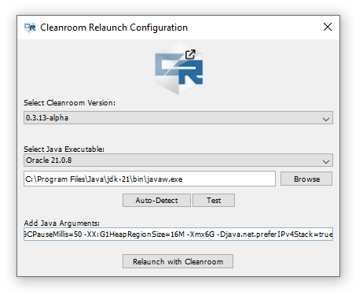

# Factoriocraft
a Minecraft Modpack by **Execute**, **OrangeLeaf36**, **TBar** and **GhostglowDev**.

---

## Installation
1. Download the repo's ZIP
2. Install [JDK 21](https://www.oracle.com/java/technologies/downloads/#jdk21-windows) 
> - __[[Direct Download (Windows)](https://download.oracle.com/java/21/latest/jdk-21_windows-x64_bin.exe)]__ <br>
> - __[[Direct Download (Mac)](https://download.oracle.com/java/21/latest/jdk-21_macos-x64_bin.dmg)]__ <br>
> - __[[Direct Download (Linux)](https://download.oracle.com/java/21/latest/jdk-21_linux-x64_bin.tar.gz)]__ <br>
3. Install JDK 21 with the downloaded Installer.
4. Follow the Steps to Setup a Modpack according to your Launcher.
> - [**SKLauncher**]() <br>
> - [**Prism Launcher**]()
5. Launch.
6. a Popup will appear for Cleanroom Relauncher,
> 
> - **Select Cleanroom Version**: `0.3.13-alpha`
> - **Select Java Executable**: Press [**Auto-Detect**]
> - **Add Java Arguments**: 
> ```
>  -XX:+UnlockExperimentalVMOptions -XX:+UseG1GC -XX:G1NewSizePercent=20 -XX:G1ReservePercent=20 -XX:MaxGCPauseMillis=50 -XX:G1HeapRegionSize=16M -Djava.net.preferIPv4Stack=true -Xmx6G
> ```
> *(The number in `-Xmx6G` can be changed if you want to allocate more RAM into Minecraft.)*
 
---

## How to Setup a Modpack
### SKLauncher
1. Click the `+` button. 
  > 
2. Select the appropriate options:
  >    **i.**   Name it whatever you want <br>
  >    **ii.**  Select Forge and select Version 1.12.2 <br>
  >    **iii.** Path to the modpack directory. <br>
  >        (e.g. `C:\Users\user\AppData\Roaming\.minecraft\modpacks\Factoriocraft`) <br><br>
  > 
3. Click `Save`
4. Launch the Game
5. Further Installation Steps is referred [here](https://github.com/AlsoGhostglowDev/Factoriocraft#installation)

### Prism Launcher
1. Click the `Add Instance` button.
  > 
2. Select the appropriate options:
  >    **i.**   Name it whatever you want <br>
  >    **ii.**  Select Version 1.12.2 <br>
  >    **iii.** Select Forge <br>
  >    **iv.**  Select the Latest Version (or `14.23.5.2860`) <br><br>
  > 
3. Click `OK`
4. in Prism's Main Tab, Click `Folder`
  > 
5. in the Folder, create a Folder named `minecraft`
  > 
6. Paste in the folders from the ZIP into the `minecraft` folder
  > 
4. Launch the Game
5. Further Installation Steps is referred on the [Installation](https://github.com/AlsoGhostglowDev/Factoriocraft#installation) subtopic.