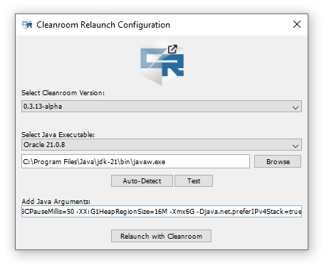
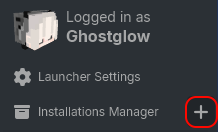
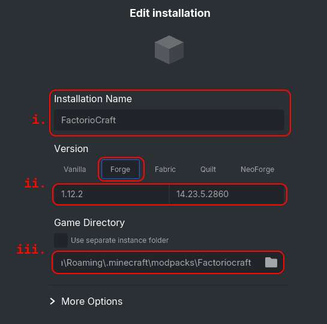

# Factoriocraft
a Minecraft Modpack by **Execute**, **OrangeLeaf36**, **TBar** and **GhostglowDev**.

---

## Installation
1. Download the repo's ZIP
2. Unzip and put in .minecraft/modpacks
3. Install [JDK 21](https://www.oracle.com/java/technologies/downloads/#jdk21-windows) 
> - __[[Direct Download (Windows)](https://download.oracle.com/java/21/latest/jdk-21_windows-x64_bin.exe)]__  
> - __[[Direct Download (Mac)](https://download.oracle.com/java/21/latest/jdk-21_macos-x64_bin.dmg)]__  
> - __[[Direct Download (Linux)](https://download.oracle.com/java/21/latest/jdk-21_linux-x64_bin.tar.gz)]__  
4. Install JDK 21 with the downloaded Installer.
5. Launch with the new Directory.
6. a Popup will appear for Cleanroom Relauncher,
> 
> - **Select Cleanroom Version**: `0.3.13-alpha`
> - **Select Java Executable**: [**Press Auto-Detect**]
> - **Add Java Arguments**: `-XX:+UnlockExperimentalVMOptions -XX:+UseG1GC -XX:G1NewSizePercent=20 -XX:G1ReservePercent=20 -XX:MaxGCPauseMillis=50 -XX:G1HeapRegionSize=16M -Djava.net.preferIPv4Stack=true -Xmx6G`   *(The number in `-Xmx6G` can be changed if you want to allocate more RAM into Minecraft.)*
 
---

## How to Setup a Modpack
### SKLauncher
1. Click the `+` button. 
> 
2. Select the appropriate option:
>    **i.**   Name it whatever you want  
>    **ii.**  Select Forge and select Version 1.12.2  
>    **iii.** Path to the modpack directory.  
>        (e.g. `C:\Users\user\AppData\Roaming\.minecraft\modpacks\Factoriocraft`)
> 
3. Click Save
4. Launch the Game