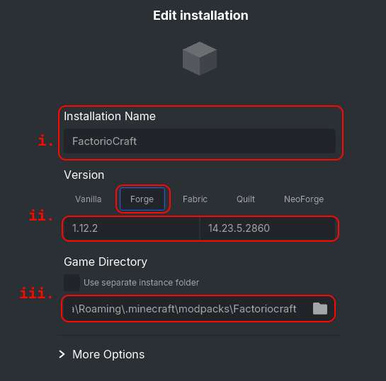
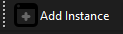
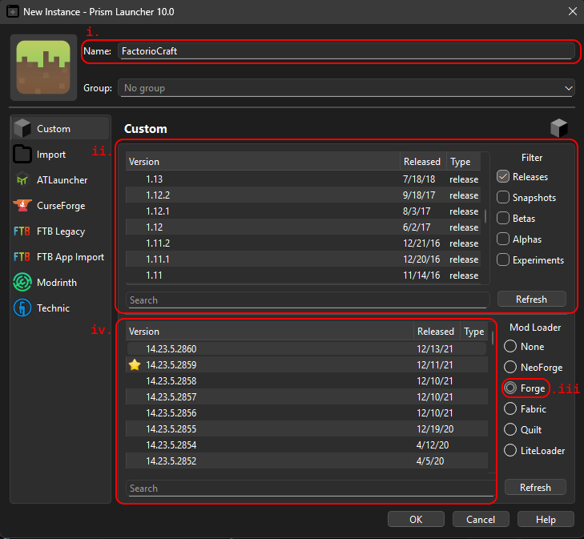
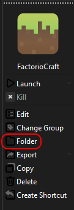
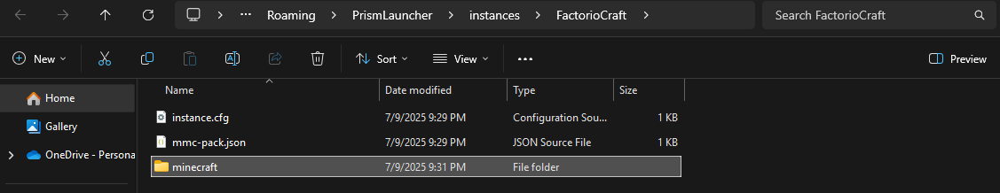
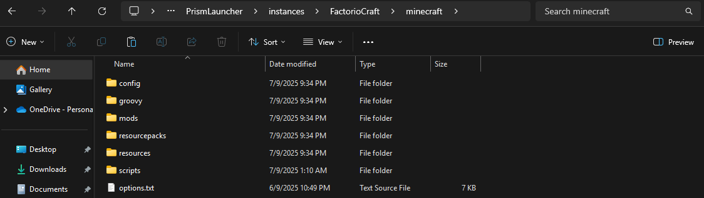

# Factoriocraft
a Quest-driven 1.12.2 Minecraft Modpack based on the game "Factorio". It has features from it's namesake which is automating almost everything in both the midgame and endgame.  
We're sent by **NeoTechnologies Alternate Reality Research Subdivision** (**NTARS**) into a level to experiment the safety of other realities.  

This modpack focused around **OpenComputers** (robots & drones) and other Technology Mods (**Mekanism, AE2, Environmental Tech and Advanced Rocketry**) while a Parasitic Race try to rule over the Level.  

The endgame features the **Bragging Rights** questline which allows you to explore the powerful weapons and tools from the **Avaritia** mod. These will help you get rid of the Parasites. 

---

Brought to you by:
- **Execute**
- **OrangeLeaf36** 
- **TBar**
- **GhostglowDev**

---

## Requirements
- atleast 8GB RAM (6GB to be allocated)

## Installation
1. Download the repo's ZIP
2. Follow the Steps to Setup a Modpack according to your Launcher.
> - [**SKLauncher**](https://github.com/AlsoGhostglowDev/Factoriocraft#sklauncher)  
> - [**Prism Launcher**](https://github.com/AlsoGhostglowDev/Factoriocraft#prism-launcher)
3. Launch.  
> (The **first launch** will install all Cleanroom Relauncher requirements, so you might need to launch it again afterwards.)

 
---

## How to Setup a Modpack
### SKLauncher
1. Click the `+` button. 
  > 
2. Select the appropriate options:
  >    **i.**   Name it whatever you want  
  >    **ii.**  Select Forge and select Version 1.12.2  
  >    **iii.** Path to the modpack directory.  
  >        (e.g. `C:\Users\user\AppData\Roaming\.minecraft\modpacks\Factoriocraft`)   
  > 
3. Click `Save`
4. Launch the Game

### Prism Launcher
1. Click the `Add Instance` button.
  > 
2. Select the appropriate options:
  >    **i.**   Name it whatever you want  
  >    **ii.**  Select Version 1.12.2  
  >    **iii.** Select Forge  
  >    **iv.**  Select the Latest Version (or `14.23.5.2860`)   
  > 
3. Click `OK`
4. in Prism's Main Tab, Click `Folder`
  > 
5. in the Folder, create a Folder named `minecraft`
  > 
6. Paste in the folders from the ZIP into the `minecraft` folder
  > 
4. Launch the Game
